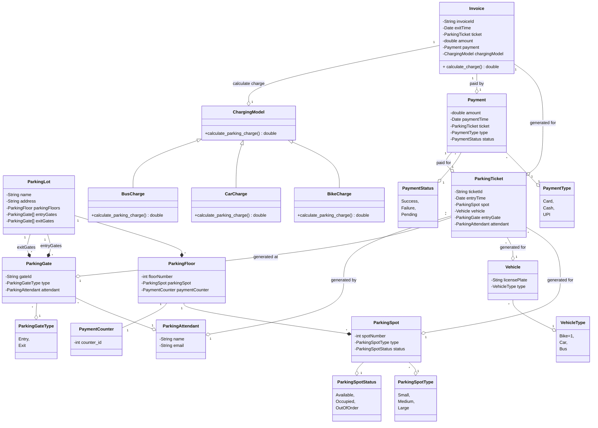

# Parking Lot Design

### class diagram

```mermaid 
classDiagram
    class ParkingLot {
       -String name
       -String address
       -ParkingFloor parkingFloors
       -ParkingGate[] entryGates
       -ParkingGate[] exitGates 
    }

    class ParkingFloor {
        -int floorNumber
        -ParkingSpot parkingSpot
        -PaymentCounter paymentCounter
    }

    class ParkingSpot {
        -int spotNumber
        -ParkingSpotType type
        -ParkingSpotStatus status
    }

    class ParkingGate {
        -String gateId
        -ParkingGateType type
        -ParkingAttendant attendant
    }

    class ParkingSpotType {
       Small, 
       Medium,
       Large 
    }
    
    class ParkingSpotStatus {
        Available,
        Occupied,
        OutOfOrder
    }

    class ParkingAttendant {
        -String name
        -String email
    }

    class PaymentCounter {
        -int counter_id
    }

    class ParkingGateType {
        Entry,
        Exit
    }

    class Vehicle {
        -Sting licensePlate
        -VehicleType type
    }

    class VehicleType {
        Bike=1, 
        Car, 
        Bus
    }

    class ParkingTicket {
        -String ticketId
        -Date entryTime
        -ParkingSpot spot
        -Vehicle vehicle
        -ParkingGate entryGate
        -ParkingAttendant attendant
    }

    class Invoice {
        -String invoiceId
        -Date exitTime
        -ParkingTicket ticket
        -double amount
        -Payment payment
        -ChargingModel chargingModel
        + calculate_charge() double
    }

    class ChargingModel {
        +calculate_parking_charge() double
    }

    class BikeCharge {
        +calculate_parking_charge() double
    }

    class CarCharge {
        +calculate_parking_charge() double
    }

    class BusCharge {
        +calculate_parking_charge() double
    }

    class Payment {
        -double amount
        -Date paymentTime
        -ParkingTicket ticket
        -PaymentType type
        -PaymentStatus status
    }

    class PaymentType {
        Card, 
        Cash,
        UPI
    }

    class PaymentStatus {
        Success,
        Failure,
        Pending
    }

    ParkingLot "1" --* "*" ParkingFloor
    ParkingLot "1" --* "*" ParkingGate : entryGates
    ParkingLot "1" --* "*" ParkingGate : exitGates

    ParkingFloor "1" --* "*" ParkingSpot
    ParkingFloor "1" -- "1" PaymentCounter

    ParkingTicket "*" --o "1" ParkingSpot : generated for 
    ParkingTicket "*" --o "1" Vehicle : generated for
    ParkingTicket "*" --o "1" ParkingGate : generated at
    ParkingTicket "*" --o "1" ParkingAttendant : generated by

    Invoice "1" --o "1" ParkingTicket : generated for
    Invoice "1" --o "1" Payment : paid by
    Invoice "1" --o "1" ChargingModel : calculate charge

    Payment "*" --o "1" PaymentType
    Payment "*" --o "1" PaymentStatus
    Payment "1" --o "1" ParkingTicket : paid for

    Vehicle "*" --o "1" VehicleType

    ParkingGate "*" --o "1" ParkingAttendant
    ParkingGate "*" --o "1" ParkingGateType

    ParkingSpot "*" --o "1" ParkingSpotType
    
    ParkingSpot "*" --o "1" ParkingSpotStatus

    ChargingModel <|-- BikeCharge
    ChargingModel <|-- CarCharge
    ChargingModel <|-- BusCharge
```
