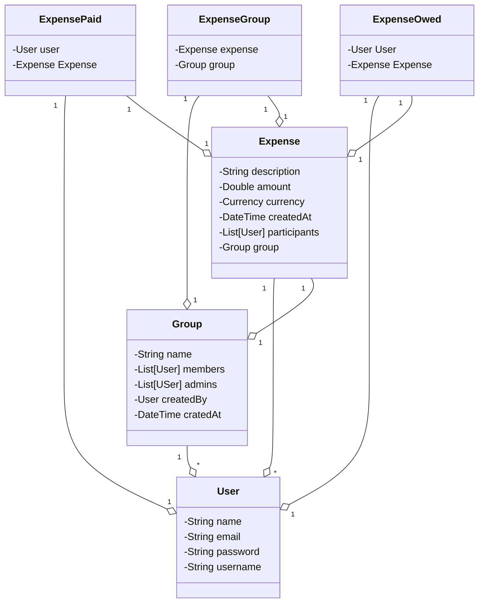

# Design Splitwise

## Class Diagram

```mermaid 
classDiagram
    class User {
        -String name
        -String email
        -String password
        -String username
    }
    
    class Expense {
        -String description
        -Double amount
        -Currency currency
        -DateTime createdAt
        -List[User] participants
        -Group group     
    }
    
    class Group {
        -String name
        -List[User] members
        -List[USer] admins
        -User createdBy
        -DateTime cratedAt
    }
    
    class ExpensePaid {
        -User user
        -Expense Expense
    }
    
    class ExpenseOwed {
        -User User
        -Expense Expense
    }
    
    class ExpenseGroup {
        -Expense expense
        -Group group
    }
    
    Expense "1" --o "*" User
    Expense "1" --o "1" Group
    Group "1" --o  "*" User
    
    ExpensePaid "1" --o "1" User
    ExpensePaid "1" --o  "1" Expense
    
    ExpenseOwed "1" --o "1"  User
    ExpenseOwed "1" --o "1"  Expense
    
    ExpenseGroup "1" --o "1" Group
    ExpenseGroup "1" --o "1" Expense
       
```