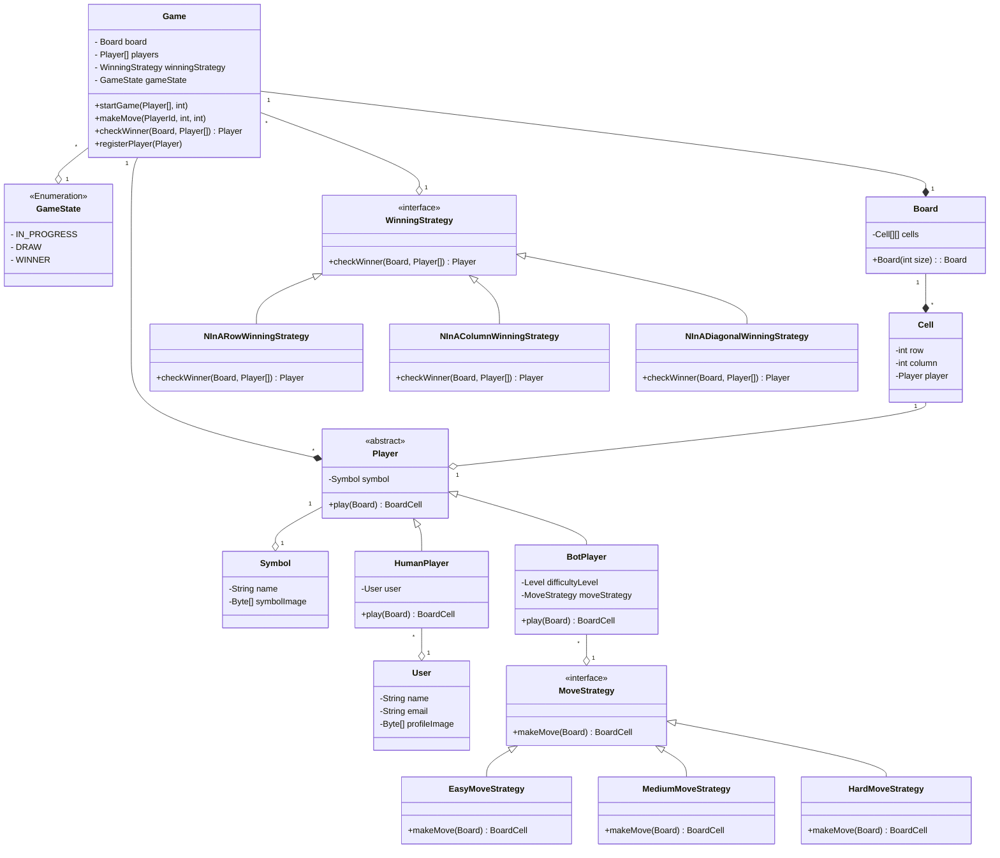

# Design Tic Tac Toe

## What is Tic Tac Toe ?
TicTacToe is a 2 player game played on a 3 x 3 board. Each player is allotted a symbol (one X and one O). Initially, the board is empty. Alternatively, each player takes a turn and puts their symbol at any empty slot. The first player to get their symbol over a complete row OR a complete column OR a diagonal wins.

You can play the game in Google Search by just searching for “tictactoe”!

## Requirements
* Board can be of NxN size.
* There can be two or more players players.
* Each (N-1) player will be allotted a different symbol.
* The symbol can be one of O, X, ... (N-1) etc.
* The players can be either humans or bots.
* Each human player will have a name, email and profile image.
* Each bot player will have a difficulty level.
* Any random player can start the game.
* Then the players will take turns sequentially.
* The player with any consecutive N symbols in a row, column or diagonal wins.
* If the board is full and no player has won, the game is a draw.
* Provision to "undo" last move.

## Extra requirements
* Tournament.
* Leaderboard.
* Replay moves/ Rewatch game.
* Pause/Resume game.

## Entities and Attributes
* Game
  * Board
  * Players
* Board
  * Cells
* Cell
  * Row
  * Column
  * Symbol
* Human Player
  * Name
  * Email
  * Profile Image
* Bot Player
  * Difficulty Level

## Class Diagram 

## Expectations
* The code should be working and functionally correct
* Good software design practices should be followed:
* Code should be modular, readable, extensible
* Separation of concern should be addressed
* Project structured well across multiple files/ packages
* Write unit tests
* CLI app, no need of GUI

