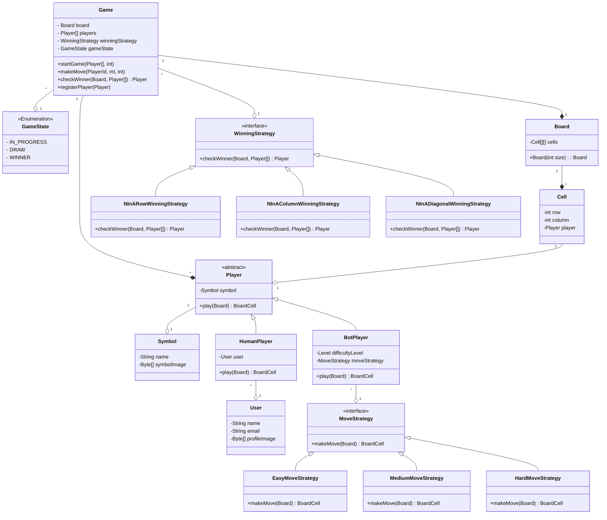

# Design Tic Tac Toe

## Overview: What is Tic Tac Toe ?
TicTacToe is a 2 player game played on a 3 x 3 board. Each player is allotted a symbol (one X and one O). Initially, the board is empty. Alternatively, each player takes a turn and puts their symbol at any empty slot. The first player to get their symbol over a complete row OR a complete column OR a diagonal wins.

You can play the game in Google Search by just searching for “tictactoe”!

What kind of design ?
* Object entity
* Interactive application (Desktop application), with no data persistence.
* Web application (Real world application), with data persistence.

Current design: Interactive application (CLI/Desktop app)

## Requirements
* Board can be of NxN size.
* 2 or more players, upto N-1.
* Each (N-1) player will be allotted a different symbol.
* The symbol can be one of O, X, ... (N-1) etc.
* The players can be either humans or bots, only 1 bot per game.
* Each bot player will have a difficulty level.
* How does a game start ?
  *  Any random player can start the game.
* How does the game proceed ?
  *  Then the players will take turns sequentially.
* How does the game end ?
    * Draw/ No Result
    * Win
        * What are the different ways in which the game can be won ?
          * Row, Col, Diagonal
        * Does the game end when -
          * 1 player wins
          * All (N-2) players win except 1 last player
* Provision to "Undo" last move.
* Provision to rewatch/replay all moves.

## Extra requirements
* Tournament.
* Leaderboard.
* Blocked Cells.
* Pause/Resume game.

## Entities and Attributes
* Game
  * Board
  * List<Player> Players
  * GameStatus
  * Player Winner
  * NextTurnPlayer
  * List<Move> Moves
  * List<GameWinningStrategy> GameWinningStrategies

* Board
  * Dimension
  * Cells

* Cell
  * Row
  * Column
  * Player

* Player
  * Symbol
  * Name
  * PlayerType

* Bot Player
  * DifficultyLevel
  * BotPlayingStrategy

## Class Diagram 

## Expectations
* The code should be working and functionally correct
* Good software design practices should be followed:
* Code should be modular, readable, extensible
* Separation of concern should be addressed
* Project structured well across multiple files/ packages
* Write unit tests
* CLI app, no need of GUI

